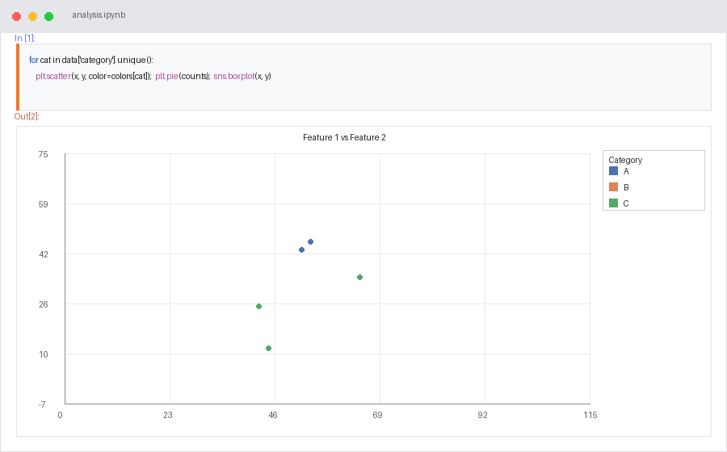

<table style="border-collapse: collapse; border: none;" border="0" cellspacing="0" cellpadding="0" frame="void" rules="none">
  <tr style="border: none;">
    <td style="border: none; vertical-align: top; padding-right: 30px;" width="70%">
      

<h2> About Me</h2>

I'm Gurudayal Yadav, a Computer Science Engineering undergraduate with a strong passion for Machine Learning, Data Science, and Software Development. I’m focused on building a strong career in Machine Learning by developing practical skills, working on real-world projects, and continuously exploring new technologies.

I have been strengthening my programming and problem-solving abilities through Data Structures and Algorithms (DSA) using Java, regularly solving coding and LeetCode problems to improve my logical thinking and programming fundamentals. Alongside DSA, I'm learning the foundations of Machine Learning, data preprocessing, model building, evaluation, and practical implementation using Python and Scikit-learn.

I enjoy turning what I learn into practical projects and experiments, while continuously improving my understanding of both ML concepts and software development. My goal is to become a skilled **Machine Learning Engineer** who can combine strong programming, analytical thinking, and machine learning knowledge to solve real-world problems.

I'm a continuous learner who believes in learning by building, practicing consistently, and improving every day. My GitHub represents my learning journey, projects, coding practice, and progress toward building a strong career in technology.

    </td>
    <td style="border: none; vertical-align: top;" width="30%">
      
  </tr>
</table>

### 🚀 What I'm Currently Doing

* 🤖 Learning and exploring Machine Learning & Data Science
* 💻 Solving DSA and LeetCode problems using Java
* 📊 Working on practical ML projects
* 🧠 Strengthening problem-solving and programming fundamentals
* 🔍 Exploring new technologies and industry-relevant skills
* 📚 Continuously learning and improving every day

### 🎯 My Goal

My goal is to become a skilled Machine Learning Engineer with strong programming and problem-solving abilities. I believe in learning by building, practicing consistently, and improving step by step.

> Learn → Build → Practice → Improve → Repeat.

</h3>

  

---

### 🧠 About Me

- 🎓 CS/BTech student focused on Machine Learning & AI
- 🛠️ Shipped end-to-end ML projects: Spam Classifier, Breast Cancer Detection, Diabetes & Salary Prediction, Health Condition Predictor
- 🤖 Builting a personal JARVIS-style assistant — GURUDAYAL
- 📚 Currently prepping for Job Interview and sharpening DSA in Java
- 🌱 Learning: Deep Learning, NLP, MLOps
- 📍 Based in Jaunpur, Uttar Pradesh, India

---

### 🧰 Skills

**Languages**

  
  
  
  
  

**Data Science & ML**

  
  
  
  
  
  

**Database & Cloud**

  
  
  
  

**Frameworks & Tools**

  
  
  
  
  
  

---

### 📊 GitHub Stats

### 🖥️ Contribution Graph —

 
 
###  Connect With Me

  
  
  
  

---

<i>⭐️ From <a href="https://github.com/yadavgurudayal133-ctrl">yadavgurudayal133-ctrl</a> — building in public, one commit at a time.</i>

